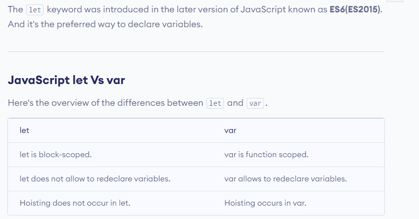
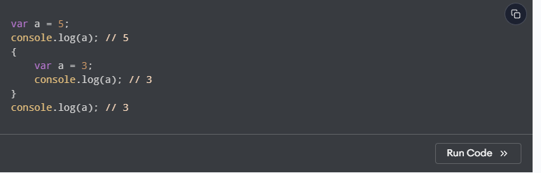
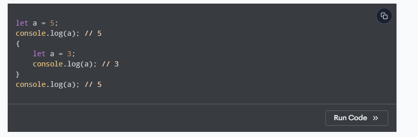
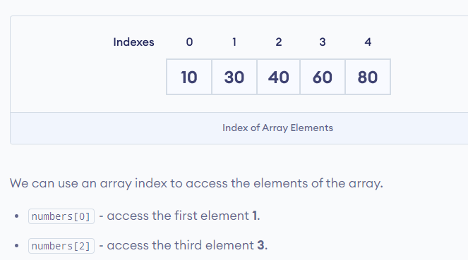
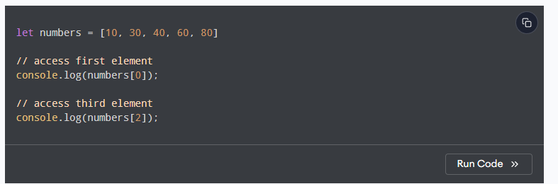
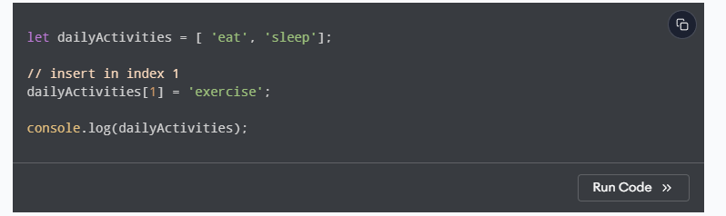

# Data declaration

## Var , Let , const

In programming, a variable is a container (storage area) to hold data. For example,

let num = 5;



### Redeclaring a variable with var in a different scope or block changes the value of the outer variable too. For example





# ARRAY [ data structures use to store a list of items]

An array is an object that can store multiple values at once.

Suppose we need to record the age of 5 students. Instead of creating 5 separate variables, we can simply create an array:

## Create an Array

We can create an array by placing elements inside an array literal [], separated by commas. For example,

const numbers = [10, 30, 40, 60, 80]

numbers - name of the array

[10, 30, 40, 60, 80] - elements of the array

```javascript
const firstName = "Zaid";
const friends = ["jomana", "barbara", "yak"];

const zaid = [firstName, "mohammed", 2024 - 2000, friends];
console.log(zaid);
```

## Access Elements of an Array

Each element of an array is associated with a number called an index. The index specifies the position of the element inside the array.

For the array,

let numbers = [10, 30, 40, 60, 80]





## compare array

```javascript
'hi' === 'hi' // true
1=== 1// true

[1,2,3] = [1,2,3]
```

## Change the Elements of an Array

We can add or change elements by accessing the index value



## Length of an Array

We can find the length of an array using the length property. For example,

### the length, the items or types are dynamic

const dailyActivities = [ 'eat', 'sleep'];

// return the length of array

console.log(dailyActivities.length);

## Add Element to an Array

We can add elements to an array using built-in methods like push() and unshift() and splice.

```javascript
const numbers = [3, 4];
// End
numbers.push(5, 6);
//Beginning
numbers.unshift(1, 2);
//middle
numbers.splice(2, 0, "a", "b");

console.log(numbers);
```

## Remove Elements from an Array

We can remove an element from any specified index of an array using the splice() method.

```javascript
const numbers = [1, 2, 3, 4];

//End
const last = numbers.pop(); //return the last number

console.log(numbers);
console.log(last);
// Beginning

const first = numbers.unshift();

//Middle
const middle = numbers.splice(2, 2);
```

##Emptying an Array

```javascript
let numbers = [1, 2, 3, 4];

//solution 1

numbers = [];

// solution 2
numbers.length = 0;

numbers.splice(0, numbers.length);

//
```

## Finding Elements(primitives)

```javascript
const numbers = [1, 2, 3, 1, 4];

console.log(numbers.indexOf(a)); // -1

console.log(numbers.indexOf(1)); //0

console.log(numbers.indexOf("1")); //-1

console.log(numbers.lastIndexOf(1)); //3
```

## check on includes

## joining /split() Arrays

```javascript
const numbers = [1, 2, 3];
const joined = numbers.join(","); // 1,2,3
console.log(joined);

const message = "This is my first message";
const parts = message.split(" ");
console.log(parts);

const combined = parts.join("-");
console.log(combined);
```

## Combining and Slicing Arrays

```javascript
const first = [1, 2, 3];
const second = [4, 5, 6];

const combined = first.concat(second);
console.log(combined); //[1,2,3,4,5,6]

const slice = combine.slice(2, 4);
console.log(slice); // [3,4]
```
