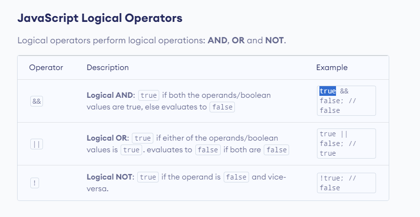
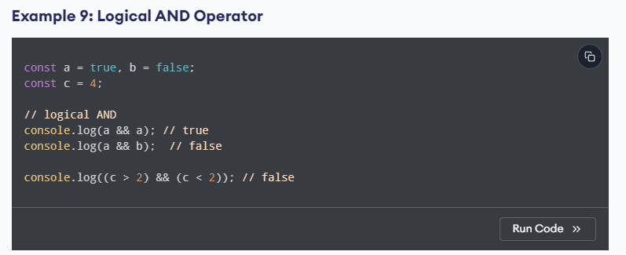
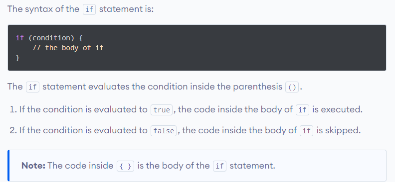
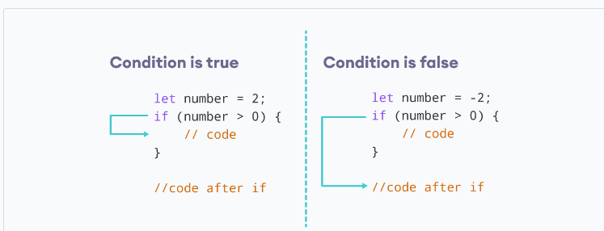
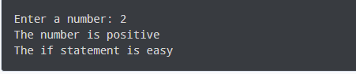
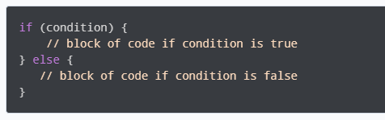
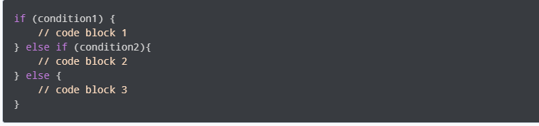
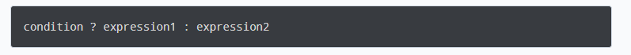

# JS Control Flow

## JavaScript if...else Statement





In computer programming, there may arise situations where you have to run a block of code among more than one alternatives. For example, assigning grades A, B or C based on marks obtained by a student.

In such situations, you can use the JavaScript if...else statement to create a program that can make decisions.

### In JavaScript, there are three forms of the if...else statement.

- if statement
- if...else statement
- if...else if...else statement





```Javascript

// check if the number is positive
const number = prompt("Enter a number: ");

// check if number is greater than 0
if (number > 0) {
 // the body of the if statement
  console.log("The number is positive");
}
console.log("The if statement is easy");
```





```javascript
// check if the number is positive or negative/zero

const number = prompt("Enter a number: ");

// check if number is greater than 0
if (number > 0) {
  console.log("The number is positive");
}
// if number is not greater than 0
else {
  console.log("The number is either a negative number or 0");
}

console.log("The if...else statement is easy");
```

### JavaScript if...else if statement



```javascript
// check if the number if positive, negative or zero
const number = prompt("Enter a number: ");

// check if number is greater than 0
if (number > 0) {
  console.log("The number is positive");
}
// check if number is 0
else if (number == 0) {
  console.log("The number is 0");
}
// if number is neither greater than 0, nor zero
else {
  console.log("The number is negative");
}

console.log("The if...else if...else statement is easy");
```

### Nested if...else Statement

```javascript
// check if the number is positive, negative or zero
const number = prompt("Enter a number: ");

if (number >= 0) {
  if (number == 0) {
    console.log("You entered number 0");
  } else {
    console.log("You entered a positive number");
  }
} else {
  console.log("You entered a negative number");
}
```

## JavaScript Ternary Operator

A ternary operator evaluates a condition and executes a block of code based on the condition.



The ternary operator evaluates the test condition.

If the condition is true, expression1 is executed.
If the condition is false, expression2 is executed.
The ternary operator takes three operands, hence, the name ternary operator. It is also known as a conditional operator.

```javascript
// program to check pass or fail

let marks = prompt("Enter your marks :");

// check the condition
let result = marks >= 40 ? "pass" : "fail";

console.log(`You ${result} the exam.`);
```

## Ternary Operator Used Instead of if...else

```Javascript
// check the age to determine the eligibility to vote
let age = 15;
let result;

if (age >= 18) {
      result = "You are eligible to vote.";
} else {
      result = "You are not eligible to vote yet.";
}

console.log(result);
```

with

```javascript
// ternary operator to check the eligibility to vote
let age = 15;
let result =
  age >= 18 ? "You are eligible to vote." : "You are not eligible to vote yet";
console.log(result);
```

## Exercises

1.

```javascript
const age = 15;
if(age >= 18){
    console.log('Sarah can start driving license 🚗)
}else {
    const yearsLeft = 18- age;
    console.log(`Sarah is too young.Wait another ${yearsLeft}  years:)`);
}


```

2.  //WRITE YOUR CODE BETWEEN THIS LINE: ↓ ↓ ↓ ↓
    if(num%2===0){
    console.log("even")
    }

let Hour = 9;
if(hour > 6 && hour<12){
console.log("Good morning")
}else if(hour >= 12 && hour <18){
console.log("Good afternoon")
}else {
console.log("Good evening!")
}
