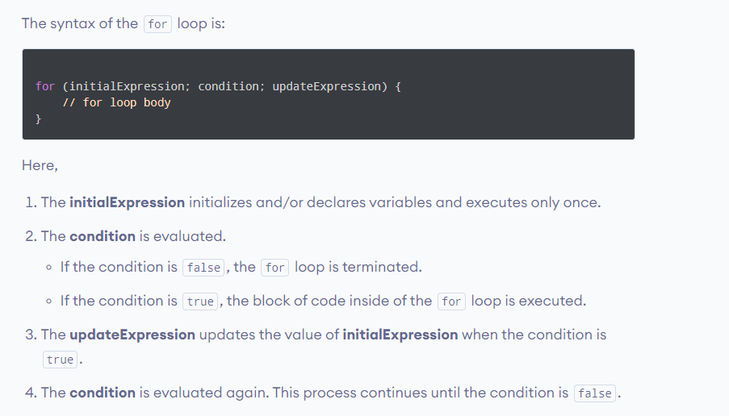
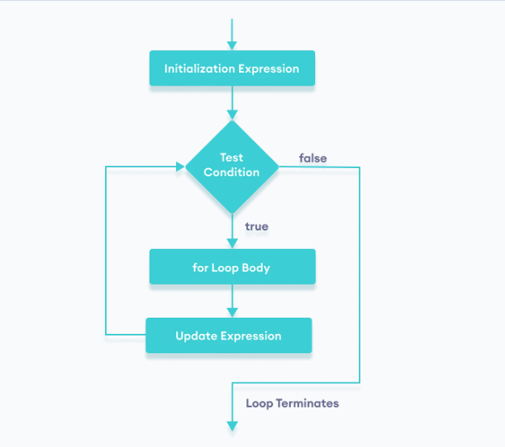
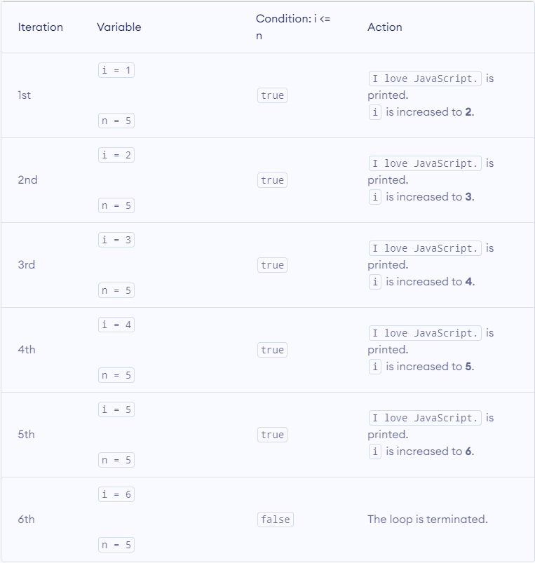
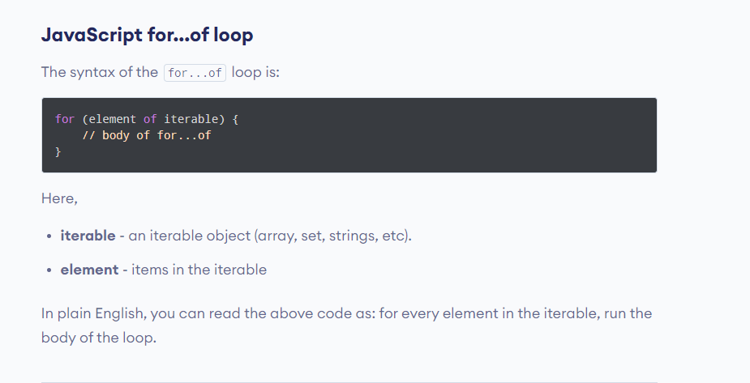
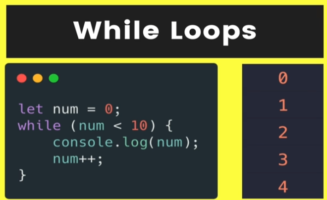
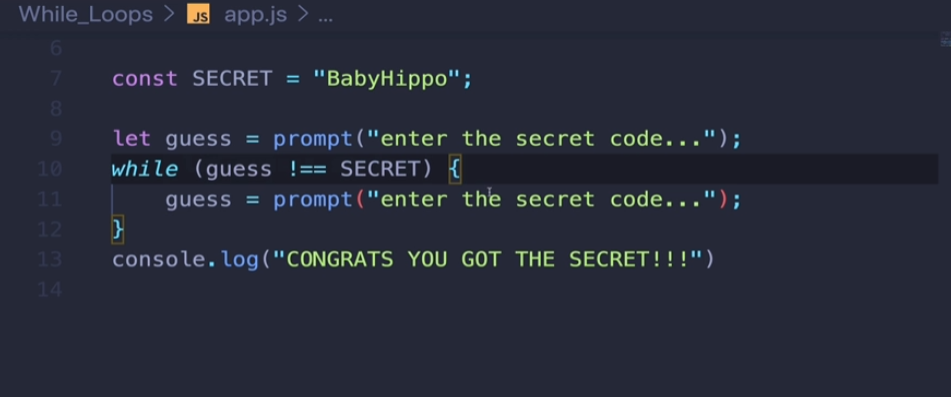
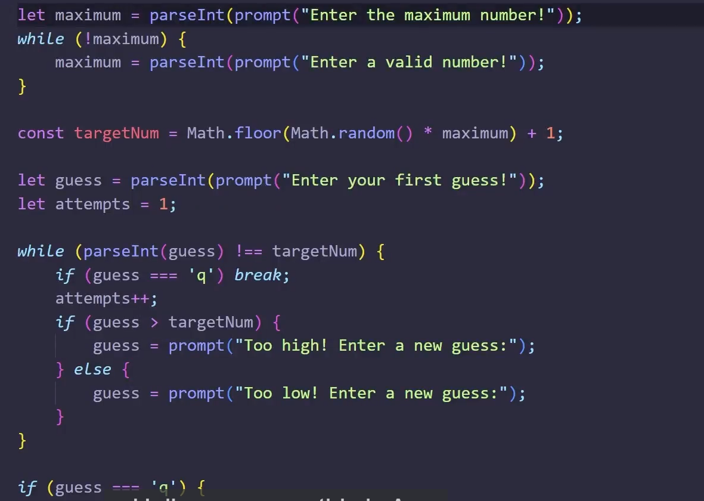
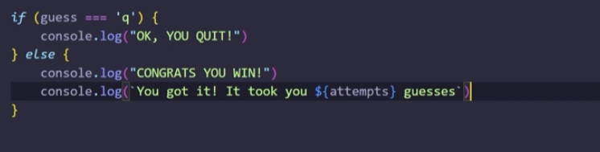

# JavaScript for loop

In programming, loops are used to repeat a block of code.

For example, if you want to show a message 100 times, then you can use a loop. It's just a simple example; you can achieve much more with loops.

## JavaScript for loop



Flow chart for for loops



## 1. Display a Text Five Times

```javascript
// program to display text 5 times
const n = 5;

// looping from i = 1 to 5
for (let i = 1; i <= n; i++) {
  console.log(`I love JavaScript.`);
}
```



### Example 2: Display Numbers from 1 to 5

```javascript
// program to display numbers from 1 to 5
const n = 5;

// looping from i = 1 to 5
// in each iteration, i is increased by 1
for (let i = 1; i <= n; i++) {
  console.log(i); // printing the value of i
}
```

### Even Numbers

```javascript
for (let i = 0; i < 21; i += 2) {
  console.log(i);
}
```

### Example 3: Display Sum of n Natural Numbers

```javascript
// program to display the sum of natural numbers
let sum = 0;
const n = 100;

// looping from i = 1 to n
// in each iteration, i is increased by 1
for (let i = 1; i <= n; i++) {
  sum += i; // sum = sum + i
}

console.log("sum:", sum);
```

### JavaScript Infinite for loop

If the test condition in a for loop is always true, it runs forever (until memory is full). For example,

```javascript
// infinite for loop
for (let i = 1; i > 0; i++) {
  // block of code
}
```

### JavaScript for... of Loop



## for...of with Arrays

The for..of loop can be used to iterate over an array. For example,

```javascript
// array
const students = ["John", "Sara", "Jack"];

// using for...of
for (let element of students) {
  // display the values
  console.log(element);
}
```

### for...of with Strings

You can use for...of loop to iterate over string values. For example,

```javascript
// string
const string = "code";

// using for...of loop
for (let i of string) {
  console.log(i);
}
```

## Exercise

Iterating Arrays Exercise
I've provided you with an array of strings called people. Loop over the people array with a for loop, printing out each name in uppercase letters. Your result should look something like:

SCOOBY
VELMA
DAPHNE
SHAGGY
FRED
Hint: use i from your loop as an array index!

```javascript
const people = ["Scooby", "Velma", "Daphne", "Shaggy", "Fred"]; //DONT TOUCH THIS LINE!

// WRITE YOUR LOOP BELOW THIS LINE:
for (let i = 0; i <= people.length; i++) {
  console.log(people[i].toUpperCase());
}
```

## Nested loops

```javascript
for (let i = 0; i < seatingChart.length; i++) {
  const row = seatingChart[i];
  console.log(`ROW #${i + 1}`);
  for (let j = 0; j < row.length; j++) {
    console.log(row[j]);
  }
}
```

## While Loops





## The Break Keyword

```Javascript
let input = prompt("Hey, say something!")
whitle(true){
    input = prompt(input);
    if(input.toLowerCase() === "stop copying me"){
        break;
    }
}

console.log("OK YOU WIN!")
```

## game Development




